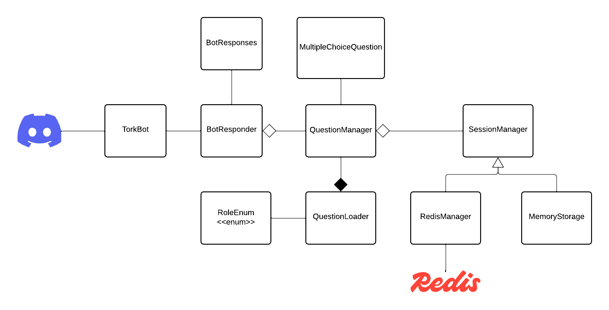

## Project Description

`This project is a personality questionnaire Discord bot designed to help 
form balanced and effective coding teams. Inspired by roles from the CSCI 120 course, 
the bot evaluates users’ strengths and preferences to assign them one of four 
team roles: Manager, Strategist, Debugger, or Speaker.
 These roles ensure that each team has a diverse skill set for efficient collaboration 
 and problem-solving. By using this bot,  users can create well-rounded teams for coding 
 projects in an engaging and interactive way.`

## System Diagram



`BotResponder handles interactions with users on Discord.
	QuestionManager manages the personality questionnaire, including presenting questions and collecting responses.
	RoleEnum represents the defined team roles (Manager, Strategist, Debugger, Speaker).
	SessionManager tracks users’ questionnaire sessions to ensure smooth and organized data flow.
	Storage utilizes RedisManager for efficient data storage and retrieval.`


## Usage

`Users interact with the bot using intuitive commands.
 The !start command begins the questionnaire,
  prompting users to answer four questions to determine their role. 
  Once completed, users can retrieve their assigned role anytime with !myrole or delete their questionnaire data using !delete. 
The !help command provides an overview of all available commands for easy navigation.`

## Technologies Used
- [AWS EC2](https://aws.amazon.com/ec2/)
- [Redis](https://redis.io/)
- [Maven](https://maven.apache.org/)
- [Docker](https://www.docker.com/)
- [GitHub](http://www.github.com/)

## Setup
### Local
1. Clone the repository into a local directory
2. Change your directory to the cloned repository:\
````cd <local repo name> ````
3. Create a .env file and add your Discord token to the file:\
````DISCORD_TOKEN="<your_token_here>"````
4. Run ````redis-server```` in a separate terminal window
5. Run ````mvn clean package```` to build the project (in new terminal window)
6. Run ````java -jar target/dbot-1.0-SNAPSHOT.jar```` to start the bot (if in terminal window)

### Local Shutdown
1. Pressing the command Ctrl + C in the terminal window the bot is running
2. Running ````redis-cli shutdown```` in a separate terminal window

### AWS
1. Run ````sudo yum install git -y```` to install git
2. Run ````sudo yum install redis6 -y```` to install redis
3. Run ````sudo yum install maven-amazon-corretto21```` to install maven
4. Clone the repository into a local directory
5. Change your directory to the cloned repository:\
````cd <local repo name> ````
6. Run ````sudo systemctl enable redis6```` to enable redis
7. Run ````sudo systemctl start redis6```` to start redis
8. Run ````mvn clean package```` to build the project
9. Run ````java -jar target/dbot-1.0-SNAPSHOT.jar```` to start the bot